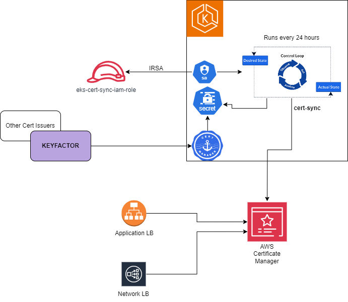

# cert-sync

`cert-sync` is a Kubernetes controller that automatically syncs TLS certificates issued by [cert-manager](https://cert-manager.io/) to [AWS Certificate Manager (ACM)](https://aws.amazon.com/certificate-manager/). This enables seamless integration of Kubernetes-managed certificates with AWS services like Elastic Load Balancers and CloudFront, ensuring that your AWS resources always have the latest valid certificates without manual intervention.



## Description

The `cert-sync` watches for Kubernetes `Secret` resources of type `kubernetes.io/tls` that are annotated for synchronization. When it detects a new or updated certificate issued by cert-manager, it checks if the certificate already exists in AWS ACM. If the certificate is new or has expired in ACM, the controller imports it into ACM. This process automates the distribution of certificates to AWS services, simplifies certificate management, and enhances security by keeping your AWS services up-to-date with the latest certificates issued in your Kubernetes cluster.

## Getting Started

### Prerequisites

- **Go** version **v1.23.1+**
- **Docker** version **25.00+**
- **kubectl** version **v1.28+**
- Access to a **Kubernetes v1.28+** cluster
- An **AWS account** with permissions to use AWS Certificate Manager (ACM)
  - Necessary IAM permissions: `acm:ImportCertificate`, `acm:ListCertificates`, `acm:DescribeCertificate`, `acm:AddTagsToCertificate`

### To Deploy on the Cluster

**1. Build and push your image to the location specified by `IMG`:**

```sh
make docker-build docker-push IMG=<your-registry>/cert-sync:<tag>
```

**NOTE:** Ensure that the image is pushed to a container registry accessible by your Kubernetes cluster (e.g., Docker Hub, ECR). You need proper permissions to push to the registry.

**2. Deploy the controller to the cluster with the image specified by `IMG`:**

```sh
make deploy IMG=<your-registry>/cert-sync:<tag>
```

> **NOTE:** If you encounter RBAC errors, you may need to grant yourself cluster-admin privileges or ensure you're logged in with sufficient permissions.

### Testing the Controller

**Create a sample `Secret` to trigger the controller:**

You can apply the sample `Secret` provided in `samples/sample-tls-secret.yaml`:

```sh
kubectl apply -f samples/sample-tls-secret.yaml
```

This sample `Secret` includes the necessary annotations to trigger synchronization to AWS ACM.

> **NOTE:** Ensure that the sample `Secret` has valid certificate and key data, and appropriate annotations. Replace placeholder values with your actual certificate data.

### To Uninstall

**1. Delete the sample `Secret` from the cluster:**

```sh
kubectl delete -f samples/sample-tls-secret.yaml
```

**2. Undeploy the controller from the cluster:**

```sh
make undeploy
```

## Project Distribution

To build the installer and distribute this project to users, follow these steps:

**1. Build the installer for the image built and published in the registry:**

```sh
make build-installer IMG=<your-registry>/cert-sync:<tag>
```

**NOTE:** The command above generates an `install.yaml` file in the `dist` directory. This file contains all the Kubernetes resources necessary to install the controller.

**2. Using the installer:**

Users can install the project by running:

```sh
kubectl apply -f https://raw.githubusercontent.com/<your-org>/cert-sync/<tag-or-branch>/dist/install.yaml
```

Replace `<your-org>`, `<tag-or-branch>`, and other placeholders with your actual GitHub organization and release tag or branch.

## Contributing

Contributions are welcome! To contribute to `cert-sync`, please follow these steps:

1. **Fork** the repository on GitHub.
2. **Create a new branch** for your feature or bugfix:

   ```sh
   git checkout -b feature/your-feature-name
   ```

3. **Make your changes** with clear commit messages.
4. **Write tests** for new features or bug fixes.
5. **Run tests** to ensure all existing tests pass:

   ```sh
   make test
   ```

6. **Update documentation** as needed.
7. **Open a pull request** with a detailed description of your changes.

Before submitting your pull request:

- Ensure your code adheres to the project's coding standards.
- Rebase your branch with the latest `main` branch.
- Check for any merge conflicts.

If you have any questions or want to discuss your proposed changes, please open an issue on GitHub.

**NOTE:** Run `make help` for more information on all available `make` targets.

More information can be found via the [Kubebuilder Documentation](https://book.kubebuilder.io/introduction.html)

## TODO

1. Enhance the code with metric and other necessary details
2. Add tests
3. Add Github Action for auto build and deploy

## License

[Apache License 2.0](LICENSE)

```
Licensed under the Apache License, Version 2.0 (the "License");
you may not use this file except in compliance with the License.
You may obtain a copy of the License at

   http://www.apache.org/licenses/LICENSE-2.0
```

Unless required by applicable law or agreed to in writing, software distributed under the License is distributed on an **"AS IS" BASIS**, WITHOUT WARRANTIES OR CONDITIONS OF ANY KIND, either express or implied. See the License for the specific language governing permissions and limitations under the License.

---

### **Additional Notes**

- **Sample `Secret` (`config/samples/tls_secret.yaml`):**

  ```yaml
  apiVersion: v1
  kind: Secret
  metadata:
    name: sample-tls-secret
    namespace: default
    annotations:
      sync-to-acm: "true"
      cert-manager.io/common-name: "example.com"
  type: kubernetes.io/tls
  data:
    tls.crt: <BASE64_ENCODED_CERTIFICATE>
    tls.key: <BASE64_ENCODED_PRIVATE_KEY>
  ```

  - Replace `<BASE64_ENCODED_CERTIFICATE>` and `<BASE64_ENCODED_PRIVATE_KEY>` with your actual certificate and private key data encoded in Base64.

- **AWS Credentials:**

  - If you're running on Amazon EKS, it's recommended to use [IAM Roles for Service Accounts (IRSA)](https://docs.aws.amazon.com/eks/latest/userguide/iam-roles-for-service-accounts.html) to grant AWS permissions to your controller.
  - Ensure that your IAM role has the necessary permissions specified in the prerequisites.

- **Environment Variables:**

  - You can specify the AWS region and other configurations via environment variables in the `manager.yaml` file.

- **Leader Election:**

  - For production environments, consider enabling leader election by adding the `--leader-elect` argument in the deployment and setting `replicas` to more than one for high availability.

**Feel free to reach out if you have any questions or need further assistance!**
